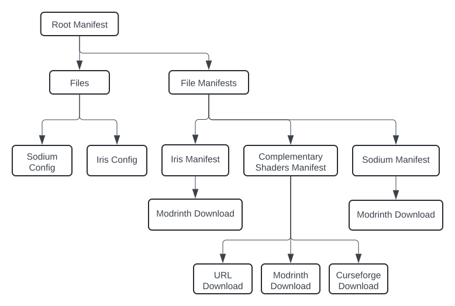

A Sculk modpack is comprised of a root manifest (`manifest.sculk.json`), many
file manifests (such as `mods/sodium.sculk.json`), and other files (such as
`config/sodium.json`).

The root manifest stores metadata about the modpack, such as its name and
Minecraft version, as well as a list of manifests and files:

- Manifests store metadata about specific file downloads. They include metadata
  such as the files name and its installation side. They also include the data
  required to download the file from either of 3 sources: Modrinth, Curseforge,
  or a direct URL. File manifests can include multiple sources, so that the most
  appropriate one can be used when exporting (i.e. use the Modrinth metadata to
  export to a Modrinth pack, but the Curseforge metadata to export to a
  Curseforge pack).
- Files are directly stored on the file system (rather than being a manifest).
  The root manifest stores their path, installation side (e.g. for client-side
  only configs), and their SHA256 hash for integrity checking.



## Dependency Tracking

When you add a mod from Modrinth or Curseforge, Sculk automatically recursively
adds its dependencies to the pack if they do not already exist. Sculk also
_tracks_ these dependencies so that if you remove the dependant mod in the
future, the dependencies can also be removed (assuming no other mods require
them). Let's use an example:

1. You add Utility Belt to your empty Fabric modpack using
   `sculk mr add utility-belt`. This adds Utility Belt, Architectury API,
   JamLib, Trinkets, and Fabric API.

   The dependency graph, stored at `dependency-graph.sculk.json`, now looks like
   this:

```json
{
  "mods/trinkets.sculk.json": [
    "mods/utility-belt.sculk.json"
  ],
  "mods/fabric-api.sculk.json": [
    "mods/utility-belt.sculk.json",
    "mods/architectury-api.sculk.json",
    "mods/jamlib.sculk.json"
  ],
  "mods/architectury-api.sculk.json": [
    "mods/jamlib.sculk.json",
    "mods/utility-belt.sculk.json"
  ],
  "mods/jamlib.sculk.json": [
    "mods/utility-belt.sculk.json"
  ]
}
```

  The graph stores a list of `<dependency mod>` to a list of its `<dependant mods>`

2. You also add Wake Up Time, which does not add any other dependencies since
   they are already satisfied. It does, however, add itself to the dependency
   graph:

```json
{
  "mods/trinkets.sculk.json": [
    "mods/utility-belt.sculk.json"
  ],
  "mods/fabric-api.sculk.json": [
    "mods/utility-belt.sculk.json",
    "mods/architectury-api.sculk.json",
    "mods/jamlib.sculk.json",
    "mods/wake-up-time.sculk.json"
  ],
  "mods/architectury-api.sculk.json": [
    "mods/jamlib.sculk.json",
    "mods/utility-belt.sculk.json",
    "mods/wake-up-time.sculk.json"
  ],
  "mods/jamlib.sculk.json": [
    "mods/utility-belt.sculk.json",
    "mods/wake-up-time.sculk.json"
  ]
}
```

3. You decide to remove Utility Belt. This also removed Trinkets, since Trinkets
   has no more dependants.
4. You also want to remove Wake Up Time. This removes JamLib, Architectury API,
   and Fabric API, since they also have no more dependants.

## Exporting

There are 3 methods for exporting/installing a Sculk modpack:

1. Direct Install (`sculk install`): this method directly downloads a Sculk
   manifest and traverses it to download all the files for the selected side.
   When a manifest is encountered, it downloads the file from one of the sources
   that manifest specifies, and when a file is encountered it copies it over to
   the correct folder.
2. Modrinth Export (`sculk export mr`): this method exports a Modrinth `mrpack`
   modpack. For manifests, it uses either the Modrinth or URL source (assuming
   the URL source is on the allowed URL list), and for files it copies them into
   the common, client, or server override folder in the modpack.
3. Curseforge Export (`sculk export cf`): this method exports a Curseforge
   `.zip` modpack. It functions similarly to the Modrinth export, but uses the
   Curseforge source.
